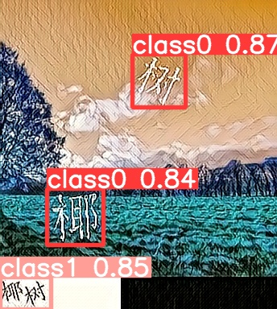

# 点击选择文字验证码识别
文字点选、选字、选择文字验证码识别  
**特点**  
无复杂环境使用，仅需要numpy与pillow即可。  
识别速度约在100~200ms之间，使用GPU话会更快
如果需要使用GPU来进行推理的话 卸载onnxruntime安装onnxruntime-gpu 

```angular2html
项目结构
---app 服务相关代码
---model 模型文件
---src  项目相关代码
```
## 更新说明
#### 20211020更新  
增加了服务启动模块，支持新版本验证码，去除pytorch依赖  
新版本的可以识别但是准确率下降许多

## 免责声明
**本项目仅供学习交流使用，请勿用于非法用途，不得在任何商业使用，本人不承担任何法律责任。**
## 训练集
  **百度网盘**  
链接：https://pan.baidu.com/s/1FF6A-YZAE1Bofgswp-D29w  
提取码：ceow  
## 实现逻辑 
**识别逻辑**
1、利用yolo框选出给出的文字和图中出现的文字，作为题目  
2、利用crnn识别给定的文字，作为答题范围  
3、根据答题范围，利用cnn预测图片中出现的文字是那个   

## 环境准备
1、安装python3.6（建议使用anconda）  
2、建立虚拟环境  
3、pip install -r requirements.txt
## 如何使用

``` bash
#普通使用
python dome.py
服务启动方式
python service.py
启动后访问http://127.0.0.1:8000/docs#/查看接口文档
bilbil演示
python bilbil.py
```  
结果如下  
```json
[
    {
        "crop": [
            231,
            173,
            297,
            248
        ],
        "classes": "target",
        "content": "拌"
    },
    {
        "crop": [
            0,
            344,
            114,
            385
        ],
        "classes": "title",
        "content": "凉拌牛肚"
    },
    {
        "crop": [
            58,
            189,
            125,
            265
        ],
        "classes": "target",
        "content": "牛"
    },
    {
        "crop": [
            231,
            271,
            297,
            343
        ],
        "classes": "target",
        "content": "肚"
    },
    {
        "crop": [
            201,
            79,
            265,
            152
        ],
        "classes": "target",
        "content": "凉"
    }
]
```
  
  

## 效果演示
**以bilbil登录验证码为例**  
```python bilbil.py```  
  
 


# 打赏
如果觉得我的项目对您有用，请随意打赏。您的支持将鼓励我继续创作！  
**o(*￣︶￣*)o**  
  
如有什么问题欢迎各位在lssues中提问  
有其他问题或需求请联系邮件**yj970814@163.com**

# 参考资料
https://github.com/ypwhs/captcha_break  
https://github.com/eriklindernoren/PyTorch-YOLOv3  
https://github.com/meijieru/crnn.pytorch  
https://github.com/chineseocr/chineseocr  
https://github.com/JiageWang/hand-writing-recognition

### 点个**star**再走呗！ 


