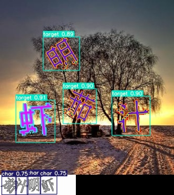
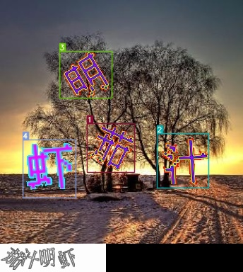
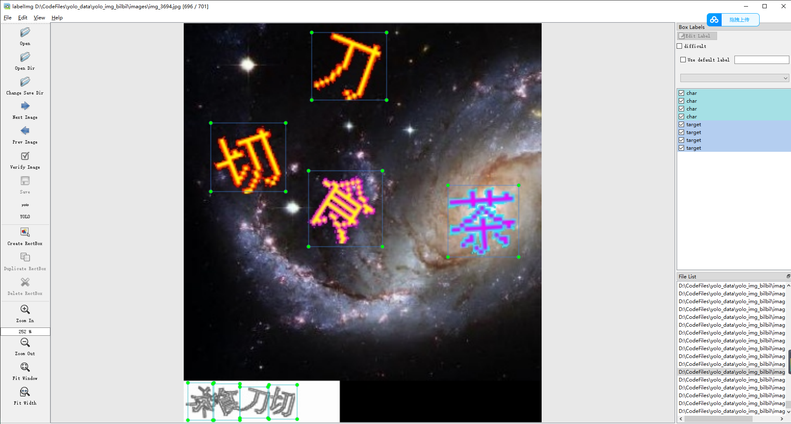
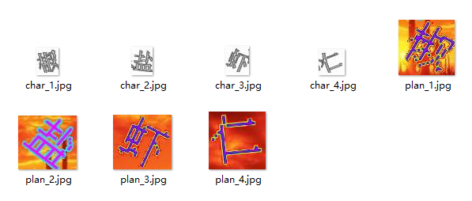
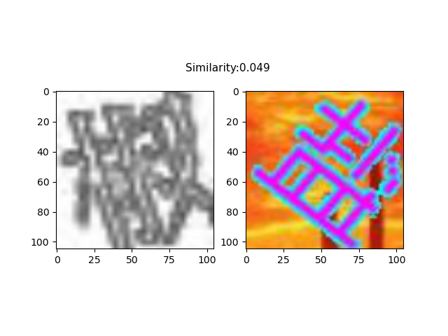
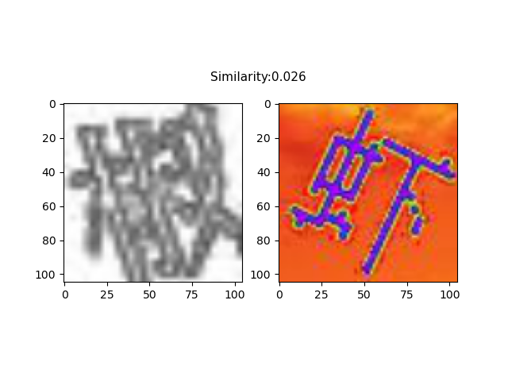
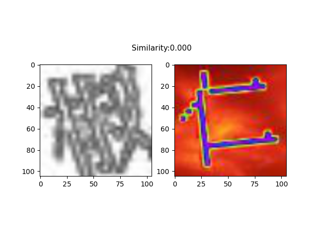

# 点击选择文字验证码识别
文字点选、选字、选择文字验证码识别  
- 特点
``` 
识别速度约在300~500ms之间  
96%的准确率  
小样本训练（此模型训练采用了300张验证码）  
低消耗，代码在低配置机器上也可运行（1核2G服务器无压力运行）  
仅在windows下python3.6、python3.8、python3.10使用
可自己训练模型使用本项目，不受平台限制
```

# 常见问题：
**关于ModuleNotFoundError: No module named 'src.utils.load' 问题：**  
模型文件被经过处理后只能使用于本项目中，本项目现在**仅支持在windows下python3.6、python3.8、python3.10使用**      
可以传入自己训练的onnx模型即可再其他环境中使用，可将参数sign修改为False并传入相应的onnx模型即可    
```python
from src.captcha import TextSelectCaptcha, drow_img
cap = TextSelectCaptcha(per_path='xxx.onnx', yolo_path='xxx.onnx', sign=False)
```
# 效果演示
  

# 免责声明
**本项目旨在研究深度学习在验证码攻防上的应用。仅供学习交流使用，请勿用于非法用途，不得在任何商业使用，本人不承担任何法律责任。**

# 请作者喝可乐**o(*￣︶￣*)o**  

| Wechat Pay | Ali Pay |
| --- | --- |
|  |  |
## 有定制需求联系邮件**yj970814@163.com**
## 有什么问题或需求欢迎各位在lssues中提问或联系邮件**yj970814@163.com**
# 如何使用
``` bash
1、准备运行环境：
pip install -r requirements.txt
2、普通使用：
python demo.py
3、服务启动方式，启动后访问http://127.0.0.1:8000/docs#/查看接口文档
python service.py
4、bilbil演示
python bilbil.py
```  
```python
from src.captcha import TextSelectCaptcha
# python代码使用
"""
per_path:   为孪生网络模型文件路径
yolo_path:  为目标检测模型文件路径
sign:       sign为True传入加密后的模型bin文件，为Flase传入onnx文件
"""
cap = TextSelectCaptcha(per_path='pre_model_v2.bin', yolo_path='best_v2.bin', sign=True)  
image_path = "docs/res.jpg"
result = cap.run(image_path)
```
结果如下：  
```
文字坐标： [[119, 174, 193, 244], [223, 189, 298, 267], [87, 69, 158, 140], [31, 196, 109, 275]] 耗时：163ms
返回的结果为文字在图片中的坐标，返回坐标的顺序就是文字点击的顺序
```
| 原始 | 检测 | 识别 |
| --- | --- |--- |
|  |  | |

# 更新说明
#### 2023.04.23更新: 更改检测识别模型，修改返回结构  
#### 2023.08.18更新: 取消推理代码编译，只对模型加载地方进行编译；优化web接口
#### 2023.09.22更新：增加消消乐验证码破解
  
消消乐的说明 https://juejin.cn/post/7282889267030016061  
``` bash
python xiaoxiaole.py
执行即可找出最近的可以被消除的行或者列
```
#### 2023.09.28更新：发布v2版本模型，增加了模型的泛化能力，提升推理速度,但是准确率下降到90%左右
#### 2023.11.12更新：优化提升了模型识别准确率，略微提升推理速度，修改代码结构
#### 2024.08.17更新：修复了一些bug, 修复bilbil.py代码无法使用问题，修复bilbil.py点选位置偏移问题
#### 2024.09.12更新：更换新的孪生网络模型，在识别速度不变的情况下优化准确率, 增加了基于pyppeteer的自动化操作
# 实现流程
- 问题拆解  

**对于点选式验证码的问题，我们可以将其拆解为两个小问题：**  
  
**1、确定需要点击的字的数量和位置：** 对于点选式验证码，准确识别和定位需要点击的字的数量和位置是解决问题的关键。   其中，一种常见的目标检测算法是 YOLO，通过标注数据集和训练模型，可以实现对需要点击的字进行准确识别和定位。本项目采用的是 yolov5 模型，该模型在目标检测方面表现出色，具有高速和较高的准确性。  

**2、对点击的字进行排序：** 在确定出需要点击的字的位置后，需要按照一定的规则对这些字进行排序。采用传统的方案是通过识别图片中的文字，然后按照文字位置进行排序，但这种方法训练困难。因此，本项目采用了图片匹配模型，使用 Siamese 孪生网络对需要点击的字与预先准备好的字库中的字进行匹配，找到最佳匹配的字，并按照一定的规则进行排序。Siamese 孪生网络在图像匹配方面表现优异，能够有效地提高排序的准确性和稳定性。
- 部分训练集  
  
  百度网盘链接：https://pan.baidu.com/s/1IYfxVpanXyqVQ8ZFVOskrg 提取码：sp97
- 训练模型  
  
***训练代码在下方参考文档中***  
**yolov5训练过程：**  
训练流程一般包括如下几个步骤：获取训练数据集、数据预处理、模型选择、设置损失函数、反向传播和更新权值等。

对于 YOLO 模型的训练流程，可以参考下方参考文档中的文档。基本流程是，首先下载训练数据集，数据集应该包含带有标注的图像和对应的标注数据。然后使用标注工具对图像进行标注，标注工具可以在 GitHub 上找到。标注的数据应该包括目标的类别和位置信息。
<div align=center>

<div>yolo标注结果</div>
</div>
如图所示，可以对背景图中的文字进行 char 类别的标注，对需要检测的文字进行 target 类别的标注。在训练时，模型会学习如何从图像中定位和识别目标文本。

接下来是选择合适的模型。YOLO 系列模型有多个版本，可以根据不同的需求选择适合的版本。选择好模型后，需要设置损失函数和训练参数，进行模型训练。在训练过程中，需要采用反向传播算法计算损失函数的梯度，并更新权值，以提高模型的预测准确度。本项目使用的预训练模型是**yolov5s6**。

训练结束后，可以将模型保存成 ONNX 格式，以便在推理时进行加载和使用。
<div align=center>

<div>yolo检测结果</div>
</div>

**Siamese训练过程：**  

在使用孪生网络进行图像检索任务的训练前，需要对数据集进行准备。与其他模型不同，孪生网络的训练需要用到正负样本对，因此需要对数据集中的每张图像都生成一些与之匹配和不匹配的样本对。

具体实现时，一般采用已经训练好的检测模型来生成样本对。

具体操作流程如下：首先，使用检测模型对数据集中的图像进行检测，截取出每个目标的图像片段；然后，把该图像片段分别与数据集中的其他目标进行匹配和不匹配的组合，形成匹配和不匹配的样本对；最后，根据样本对的匹配情况对其进行标注，将匹配和不匹配的样本对分别放到不同的文件夹中，按照类别和顺序标注好，方便后续使用。

如下图所示，每张图像都会对应一个匹配和不匹配的样本对，每个样本对包含两张图像，分别作为孪生网络的输入。

<div align=center>

<div>孪生网络标注结果</div>
</div>

训练数据准备好后，具体训练过程可参考下方参考文档中的文档。

同样的，训练结束后，可以将模型保存成 ONNX 格式，以便在推理时进行加载和使用。

<div align=center>




<div>孪生网络标注结果</div>
</div>

如图所示，孪生网络输出的结果可以给出背景图中的目标与右下角的目标最相似的结果，而左下角的目标则可以通过按照左坐标进行排序来得到。由此，可以方便地得到背景图中所有目标的顺序。

- 推理部署

推理部署过程是将 YOLO 和 Siamese 模型都转换为 ONNX 模型，以便在 CPU 上使用模型，并提高部署难度和运行速度。通过模型转换，可以将模型从原有的深度学习框架中的特定格式转换成 ONNX 格式，使得模型可以在多个平台上使用，并且可以在不同的编程语言之间轻松交互。  
**onnx介绍：**
```
  ONNX，即开放神经网络交换格式（Open Neural Network Exchange），是一个可以让不同深度学习框架之间互相转换和
使用模型的开放标准。它由 Facebook 和 Microsoft 共同开发，旨在为深度学习模型的部署和迁移提供更加方便和灵活的解决方案。
ONNX 支持包括 PyTorch、TensorFlow、CNTK 和 MXNet 等在内的多个深度学习框架，可以将这些框架训练出的模型转换成
ONNX 格式，从而可以被其他框架或应用所使用。

ONNX 的主要优点包括：

互操作性好：ONNX 支持多个深度学习框架之间的模型转换，使得它们可以互相使用和部署，从而减少了开发和部署的难度和成本；

高效性能：ONNX 可以在多种硬件和软件平台上运行，并提供了 C++和 Python 接口，可以大幅提高模型执行的效率和速度；

易于扩展：ONNX 的架构简单清晰，可以轻松地添加新的层次和类型，方便应对不断升级变化的深度学习技术和需求。

总之，ONNX 是一个方便快捷的深度学习模型转换和交换标准，可以帮助开发者更加轻松地将深度学习模型进行部署和迁移。
```
在将模型转换为 ONNX 格式后，对代码进行编译也是必不可少的一步。通过编译，可以将 Python 代码转换成机器语言代码，进一步提高模型的运行效率和速度。同时，也可以减少代码的存储空间，使得模型能够更快地在 CPU 上加载和运行。
###  参考文档
https://github.com/ultralytics/yolov5  
https://github.com/bubbliiiing/Siamese-pytorch

### 点个**star**再走呗！
