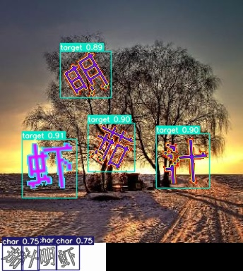
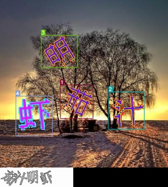
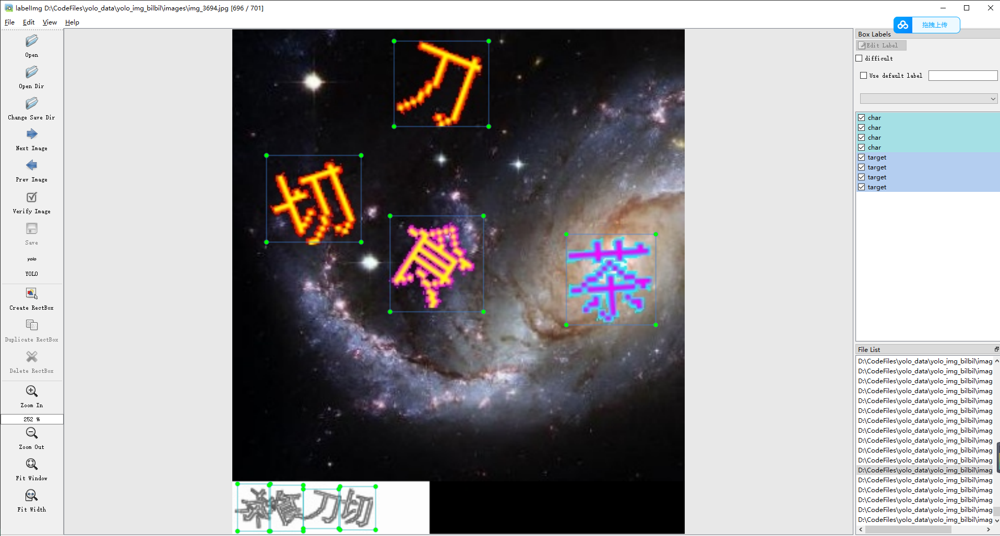
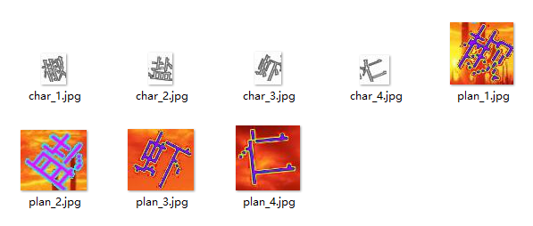
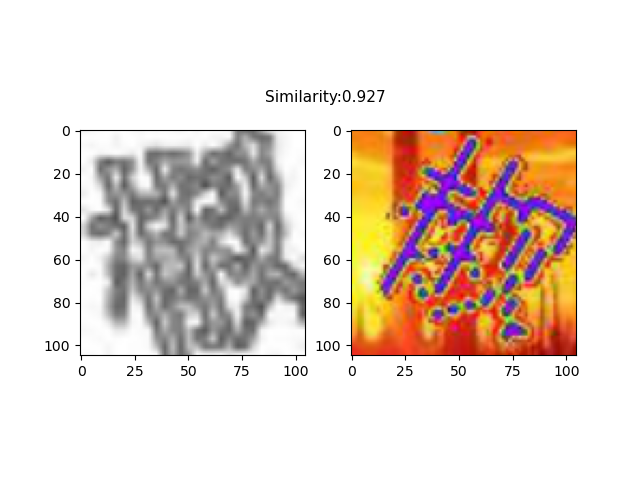
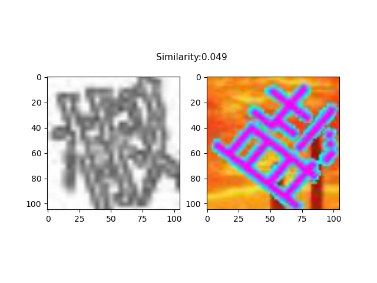
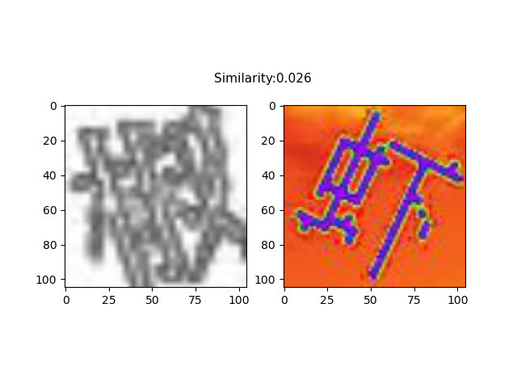
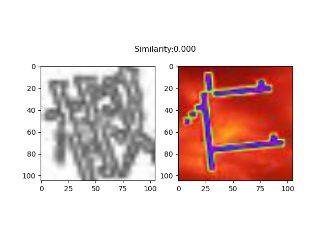
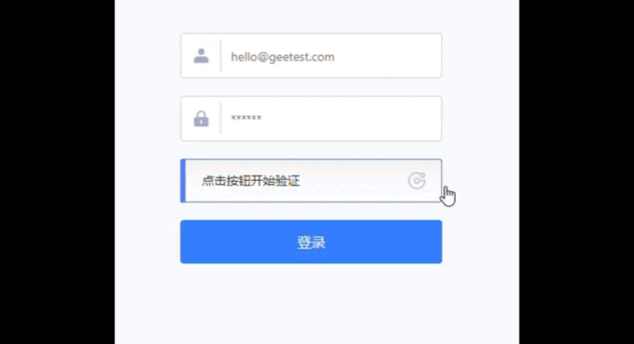
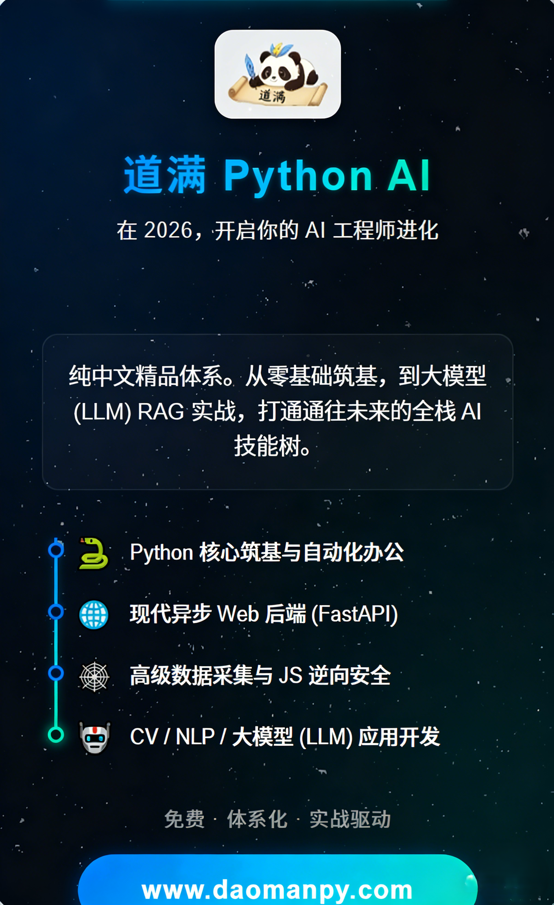

# 点击选择文字验证码识别系统

一款基于深度学习的高性能验证码识别解决方案，专为文字点选、选字、选择文字等交互式验证码设计。

## 🚀 项目特色

- **高速识别**：平均响应时间 300~500 毫秒，满足实时处理需求
- **高精度**：综合识别准确率达 96%，保障业务连续性
- **轻量化训练**：仅需约 300 张验证码图片即可完成模型训练
- **低资源消耗**：支持在低配置机器（1核2G服务器）上稳定运行
- **跨平台兼容**：支持 Windows、Linux、macOS，需 Python 3.8+
- **灵活扩展**：支持自定义模型训练，适应不同平台的验证码

## ✨ 功能亮点

- 文字点选验证码识别
- 消消乐类验证码破解
- RESTful API 接口服务
- 批量处理能力
- 高精度坐标定位
- 自动化测试集成

## 📸 效果展示


## 📋 快速开始

### 环境配置

```bash
# 克隆项目
git clone https://github.com/MgArcher/Text_select_captcha.git
cd Text_select_captcha

# 安装依赖
pip install -r requirements.txt
```

### 使用示例

**1. 命令行快速体验**

```bash
python demo.py
```

**2. 启动 Web API 服务**

```bash
python service.py
```
服务启动后访问 `http://127.0.0.1:8000/docs` 查看交互式 API 文档。

**3. 消消乐验证码识别**

```bash
python xiaoxiaole.py
```

**4. Bilibili 自动化演示**

```bash
python bilbil.py
```

### Python API 调用

```python
from src.captcha import TextSelectCaptcha

# 初始化识别器
cap = TextSelectCaptcha()

# 加载验证码图片
image_path = "docs/res.jpg"

# 执行识别（返回坐标列表）
result = cap.run(image_path)

# 获取字典格式结果
result_dict = cap.run_dict(image_path)
```

#### 输出结果详解

**坐标格式结果：**

```
文字坐标：[[119, 174, 193, 244], [223, 189, 298, 267], [87, 69, 158, 140], [31, 196, 109, 275]] 耗时：163ms
```

**字典格式结果：**

```json
{
  "imgW": 344,
  "imgH": 384,
  "point": [
    {
      "x_rel": 159.0,
      "y_rel": 209.0
    },
    {
      "x_rel": 260.5,
      "y_rel": 229.5
    },
    {
      "x_rel": 122.5,
      "y_rel": 105.0
    },
    {
      "x_rel": 69.5,
      "y_rel": 235.5
    }
  ],
  "corp": [
    {
      "x1": 126,
      "y1": 174,
      "x2": 192,
      "y2": 244
    },
    {
      "x1": 225,
      "y1": 191,
      "x2": 296,
      "y2": 268
    },
    {
      "x1": 86,
      "y1": 70,
      "x2": 159,
      "y2": 140
    },
    {
      "x1": 32,
      "y1": 196,
      "x2": 107,
      "y2": 275
    }
  ]
}
```

> **注意：** 返回的坐标顺序即为文字需要点击的顺序。

| 原始图片 | 检测结果 | 识别结果 |
| --- | --- | --- |
|  |  |  |

## 🔬 技术架构

### 核心算法

本系统将点选式验证码识别任务分解为两个关键子任务：

#### 1. 文字区域检测

采用 **YOLO** 目标检测模型（基于 `yolo` 预训练模型），通过标注数据集进行迁移学习，实现对验证码中文字区域的精准定位。

- **标注策略**：背景文字标注为 `char` 类别，待点击文字标注为 `target` 类别

<div align=center>

<p>YOLO 标注示例</p>
</div>

模型训练完成后导出为 ONNX 格式，以实现高效的 CPU 推理。

<div align=center>

<p>YOLO 检测结果示例</p>
</div>

#### 2. 点击顺序确定

运用 **Siamese 孪生网络** 架构，将检测到的文字区域与内置字库进行特征匹配，识别最相似的文字内容，并结合空间坐标关系确定最终点击顺序。

- **训练数据生成**：利用已训练的检测模型从验证码图像中提取目标区域，构建正负样本对进行对比学习

<div align=center>

<p>孪生网络样本对示例</p>
</div>

<div align=center>




<p>孪生网络特征匹配效果</p>
</div>

### 部署优化

- **ONNX 转换**：将 YOLO 和 Siamese 模型统一转换为 ONNX 格式，实现跨平台高效推理
- **CPU 优化**：针对 CPU 推理场景进行性能调优，降低部署成本
- **内存管理**：优化模型加载和推理过程，减少内存占用

> **ONNX 优势**：开放神经网络交换格式，由 Facebook 和 Microsoft 联合开发，支持 PyTorch、TensorFlow 等主流框架的模型转换与部署。

## 📈 更新历史

- **2026.04.29**：代码重构，提升识别效果与泛化能力，优化推理速度，简化部署流程
- **2024.09.12**：升级孪生网络模型，在保持识别速度的同时显著提升准确率，新增基于 `pyppeteer` 的自动化操作支持
- **2024.08.17**：修复 `bilbil.py` 兼容性问题，修正点击位置偏移，优化用户体验
- **2023.11.12**：优化识别准确率，微调推理速度，重构代码架构提升可维护性
- **2023.09.28**：发布 v2 模型，大幅增强泛化能力，提升推理速度
- **2023.09.22**：新增消消乐验证码识别功能，扩展应用场景
- **2023.08.18**：优化 Web 接口设计，改进模型加载编译机制
- **2023.04.23**：更换检测与识别模型，优化返回数据结构

### 消消乐验证码识别



> 消消乐识别原理解析：[掘金技术文章](https://juejin.cn/post/7282889267030016061)

## 📚 技术参考

- [YOLOv5 官方仓库](https://github.com/ultralytics/yolov5) - 目标检测框架
- [Siamese-PyTorch 实现](https://github.com/bubbliiiing/Siamese-pytorch) - 相似度匹配网络

## 💾 数据集资源

训练数据集已整理打包，可通过以下链接获取：

百度网盘：https://pan.baidu.com/s/1IYfxVpanXyqVQ8ZFVOskrg
提取码：`sp97`

## 🤝 贡献与支持

欢迎提交 Issue 和 Pull Request，共同完善本项目。

### 联系方式

- 邮箱：yj970814@163.com
- GitHub Issues：项目问题反馈与讨论

### 支持项目发展

如果您觉得本项目有价值，欢迎通过以下方式支持：

| 微信支付 | 支付宝 |
| --- | --- |
|  |  |

## ⚠️ 免责声明

本项目仅供学术研究和学习交流使用，旨在探讨深度学习在验证码识别领域的应用。请严格遵守法律法规，不得用于任何非法用途。作者不对因使用本项目造成的任何后果承担责任。

## 道满PythonAI

[「道满PythonAI」](https://www.daomanpy.com/) - 2026 领先的中文 Python 与 AI 体系化教程。涵盖 Python 基础、Web 后端开发、高阶爬虫、JS 逆向、计算机视觉、NLP 及大模型 (LLM) 实战，打通从零基础到 AI 全栈工程师的职业路径。



## 🌟 如果你喜欢这个项目

欢迎 Star ⭐ 本项目，让更多人了解这项技术！
